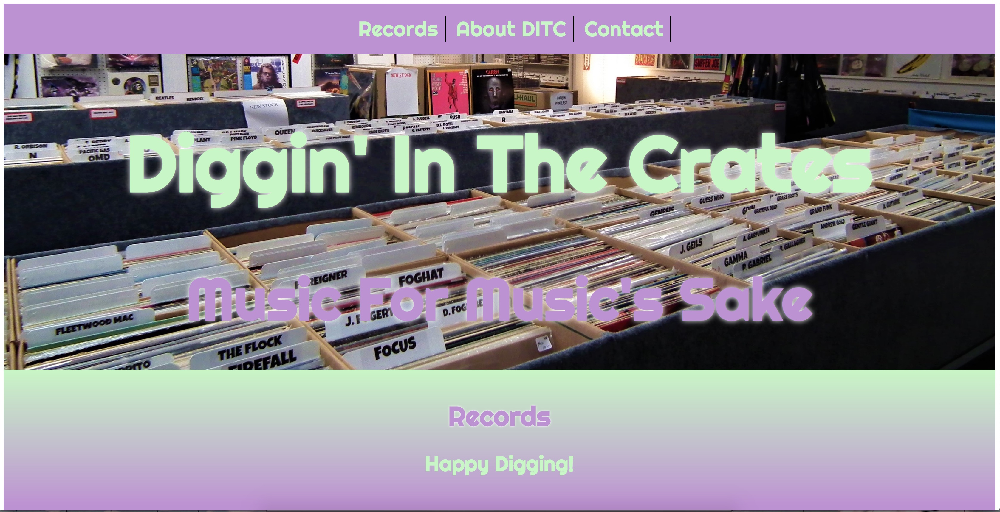
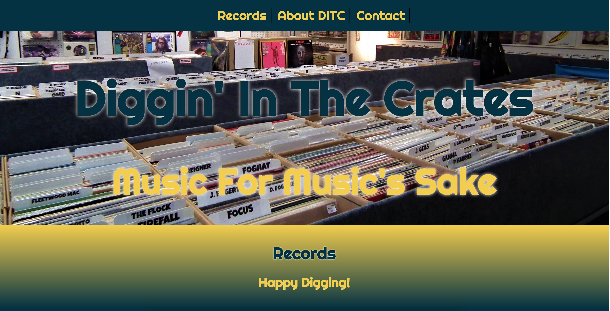

# Affiliate Marketing Templates (AMT)

Super easy to use templates for all of your purchasing/sales needs in HTML/CSS and using SASS as the CSS compiler.

## About

Affiliate Marketing Templates are templates that can be used by a user to promote products of all types, while earning a commission whenever a sale is made to a client.

We provide you with the tools to use or customize the look and feel of the webpages.

## Home Page

Click here to go to the landing page of the templates.

## Demo Screenshots

                                            Light Theme:

                                                Dark Theme:

## Use Case Examples:

- The demo's provided include a use case for selling selling CD's online with two varying templates: a 'Light' template and 'Dark' template.

- Can also be used to sell electronic devices, clothing, perfumes, colognes, etc.

- Also can be used to sell large scale items like motor vehicles, property, or even event access.